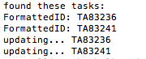

Bulk update tasks' owner
=========================

## Overview
This script example is a proof of concept of how to get attachments in Rally and filter by size

The script was tested with 1.0.1 of rally_api gem

This script is vailable AS IS. It is NOT supported by Rally.

## License

script is released under the MIT license.  See the file [LICENSE](./LICENSE) for the full text.

##Documentation for SDK

You can find the documentation on Rally toolkit for Ruby on this [site.](https://github.com/RallyTools/RallyRestToolkitForRuby)
