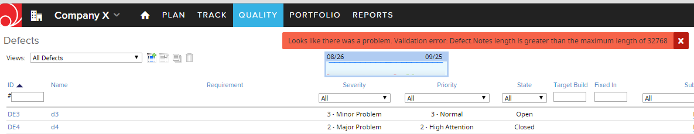
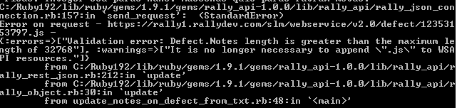
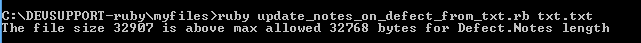

Update Defect's Notes field from a file 
=========================

## Overview

 Per "Rich text format fields" section in the [documentation](https://help.rallydev.com/common-actions):
> There is a 32Kb limitation on the Description and Notes RTF fields and 2Kb limitation on all other RTF fields. Note that a 32Kb entry immediately becomes larger than 32Kb once any type of formatting is applied to the text. Some formatting types extend each character to more than 1 byte. 

Here is a screenshot from the UI showing the error when Notes field is updated with the text that exceeds the limit. 


This Ruby script is an example of how to update Notes field from the text read from a file. If we do not validate the text size in the code, and if the size exceeds the limit, this error is returned by rally_api gem:

```
C:/Ruby192/lib/ruby/gems/1.9.1/gems/rally_api-1.0.0/lib/rally_api/rally_json_con
nection.rb:157:in `send_request':  (StandardError)
Error on request - https://rally1.rallydev.com/slm/webservice/v2.0/defect/123531
53797.js -
{:errors=>["Validation error: Defect.Notes length is greater than the maximum le
ngth of 32768"]}
        from C:/Ruby192/lib/ruby/gems/1.9.1/gems/rally_api-1.0.0/lib/rally_api/r
ally_rest_json.rb:212:in `update'
        from C:/Ruby192/lib/ruby/gems/1.9.1/gems/rally_api-1.0.0/lib/rally_api/r
ally_object.rb:30:in `update'
        from update_notes_on_defect_from_txt.rb:48:in `<main>'
```



The scrip checks the size against the limit. If the limit exceeded, the script does not proceed with the update, for example:

```
C:\DEVSUPPORT-ruby\myfiles>ruby update_notes_on_defect_from_txt.rb txt.txt
The file size 32907 is above max allowed 32768 bytes for Defect.Notes length
```



This script example is vailable AS IS. It is NOT supported by Rally.

## How to run

- Save the text to be copied to a Rally defect's Notes field to a file
- In terminal issue this command:
```
ruby myscript.rb myfile.txt
```

See the sample text file with randomly generated content that exceeded the limit - txt.txt
Removing the last paragraph from the file will allow the update to go through.

## License

AppTemplate is released under the MIT license.  See the file [LICENSE](./LICENSE) for the full text.

##Documentation for Rally Rest Toolkit For Ruby

You can find the documentation [here.](https://github.com/RallyTools/RallyRestToolkitForRuby)
